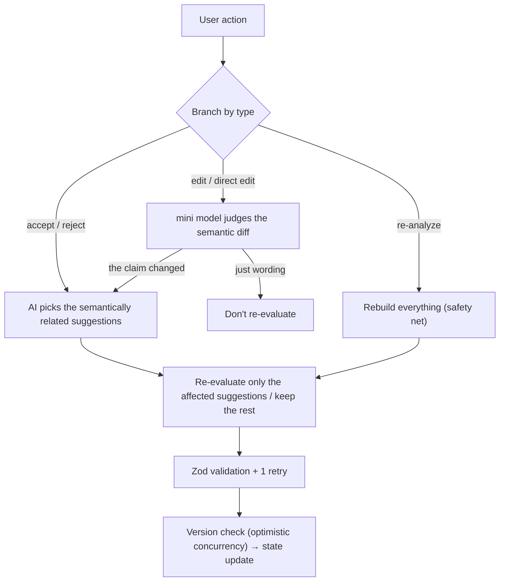

# es-canvas — Polish your essay, in your own words

> AI presents the options. The human makes the final call.

🌐 [日本語版 README](README.md)

> **Note**: "ES" (Entry Sheet) is the Japanese term for the application essay university students submit when applying to companies — the central evaluation artifact in Japan's new-graduate job hunt.

A web tool for students to refine their ES. The AI never rewrites the whole thing — it **only proposes, sentence by sentence, "here's how you could fix this."** Accepting, editing, or rejecting is always the writer's call. The design puts Human-in-the-Loop (the human stays in the decision loop) at the center. **Its core**: after you accept one suggestion, the rest aren't left as comments on the *old* text — only the semantically affected ones are re-evaluated (dynamic HITL).

- **Try it (live demo)**: <https://es-canvas.vercel.app/> (bring your own OpenAI key = BYOK)
- **Demo videos (silent, 5)**: [es1](https://youtu.be/wxCK3a4TrHA) · [es2](https://youtu.be/tAvlU7Zm1_Y) · [es3](https://youtu.be/QbB2qVrTcC8) · [es4](https://youtu.be/KWfKMMPNSfg) · [es5](https://youtu.be/a1cHOqUgmXU)
- **Walkthrough (explains the videos, in Japanese)**: [docs/submission_walkthrough.md](docs/submission_walkthrough.md)

---

## What's different

Hand your essay to AI and it gets rewritten end to end — your individual voice disappears. es-canvas does the opposite.

On top of that, four strengths:

- **Your individuality stays** — the AI never rewrites your essay. It only offers options — "here's how you could fix this" — and you choose. Your voice, and every change, stay visible and yours.
- **It draws out strengths you didn't write** — the AI asks a follow-up, "what did you do differently here?", and pulls out material from your experience that wasn't on the page.
- **The feedback evolves as you go** — each time you decide, the rest of the suggestions are rebuilt to match your essay as it stands now. Not a one-shot edit — a living one.
- **Grounded in each company** — it researches your target company for real and advises for the kind of person they want, citing sources and structurally curbing fabrication (the three-layer defense below; it can't be eliminated, only reduced).

It also sorts suggestions into three strengths — **must-fix / recommended / alternative** — distinguishing "must change" from "a matter of taste," so the AI never pushes uniformly.

---

## How to use

1. **Input** — ES body (paste or PDF/Markdown) + the prompt + the target company (URL or name) + edit conditions (preset or free input)
2. **The AI researches the company** — it investigates the hiring page etc. and organizes the values and hiring criteria **with sources**
3. **The AI analyzes the ES** — up to 15 suggestions + 3–5 likely interview questions
4. **You decide, one at a time** — accept / edit-and-accept / reject / direct edit
5. **The AI re-evaluates only the affected range** — not a full re-run, just the scope your action touched
6. **Done → copy**

> API keys are BYOK (Bring Your Own Key): each user enters their own OpenAI key (details below).

---

## What it actually does — one worked example (es1 × Mercari)

Abstractions only go so far, so here is one full pass with real output (straight from the es1 demo recording).

**Input**: an essay (debate club, first female captain, analyzed 20 past matches to redesign practice, attendance 40%→80%, 3 members placed nationally) / prompt "what you focused on most as a student" / target company "Mercari."

1. **Research the company** — the AI reads Mercari's hiring page and picks up its values "Go Bold" and "bringing others along," **with the source URL** (`careers.mercari.com/jp/hiring/`).
2. **A company-grounded suggestion** — it rewrites the closing "I learned data-driven hypothesis testing has an effect…" into "**I learned you can move an organization by giving an untried approach a concrete form, with evidence, and bringing others along**." The reason isn't a guess — it ties to the **Go Bold / involvement** values found above (with citation).
3. **Accept** — accept the suggestion that front-loads the result in the opening: "…redesigned our practice and **led 3 members to national-tournament places**."
4. **Related suggestions are rebuilt to match the essay as it stands now (dynamic HITL)** — right after the accept, another suggestion's **rationale rewrites itself**:
   - before: "'couldn't place' is vague; align it with the later 'national placement' to tighten the contrast"
   - after: "**now that the opening states 'led 3 to national places,'** aligning the problem side to the same metric makes the change land at a glance"

   Responding to your action, the AI **rephrases its other suggestions** — that is what "no stale suggestions left behind" dynamic editing actually means.

> This one pass makes "company grounding (with sources)" and "accept → related re-evaluation" concrete. All five walkthroughs are in [docs/submission_walkthrough.md](docs/submission_walkthrough.md).

---

## Design decisions (5)

Each is laid out as "**problem / decision / why**." Deeper exploration (the alternatives we rejected, etc.) lives in [docs/design_notes.md](docs/design_notes.md).

### 1. Dynamic HITL that reacts to your actions

**Problem**: Existing AI is one-shot — "input → analyze once → done." After you accept a suggestion, the analysis stays anchored to the *old* ES, leaving you to judge "does this still apply now?"

**Decision**: Branch the AI's re-evaluation — whether and how far — by what each action *means*.

| Action | AI behavior |
|---|---|
| Accept | Re-evaluate the related scope only when related suggestions exist (otherwise do nothing) |
| Reject | Reconsider only the surrounding related suggestions |
| Edit / direct edit | A lightweight model judges "just wording" vs "the claim changed"; only the latter triggers re-evaluation |
| "Re-analyze" | Rebuild everything (safety net) |

Processing flow:



**Why**: Full re-analysis is slow and costly. Move the minimum scope, by the meaning of the action. "Related or not" is judged not by mechanical numeric rules but **by the AI itself, semantically** — fewer misses and fewer false pulls, matching the essence of HITL as a semantic dialogue.

**No-wait design (optimistic concurrency)**: re-evaluation runs in the background, and while it does you can keep acting on **the suggestions it doesn't affect** (no locking) — accept another one if you like. If an action collides with an in-flight re-evaluation, the result is never silently dropped nor the screen frozen: you get a direct choice — **switch to the new result / keep your current state** (no intermediate preview). Each action is tracked against `es_state_version` so the app knows which baseline it was made on.

### 2. Model selection — measured comparison of 3 systems

**Problem**: LLM choice tends to default to "the newest" or vendor lock-in. But the balance of cost/speed/stability/quality for ES editing can't be judged from official numbers alone.

**Decision**: Measured comparison of **Anthropic Sonnet / Opus / OpenAI GPT-5.4** on a **high-completeness essay** and a **strong-personality essay** (two benchmark essays, separate from the 5 demo essays below).

| Axis | Sonnet | Opus | GPT-5.4 |
|---|---|---|---|
| Cost (2 essays) | $0.28 * | $1.44 | **$0.375** |
| Avg. latency | 132s | 285s | **111s** |
| Stability | failed on the strong-personality essay | both passed | **0 retries, both passed** |

\* including the strong-personality-essay failure. The comparison was scored on four lenses — **symptom-diagnosis accuracy / individuality preservation / reduction quality / citation rigor** (details in [docs/design_notes.md](docs/design_notes.md)). → **For v1, this measurement is the basis for *tentatively* unifying on GPT-5.4** — with only 2 essays it is a representative read, not a hard verdict, so the reproducible benchmark `pnpm test:analyze-bench` is kept. Roles split: full (analysis, company research, interview questions) vs. mini (semantic-diff judgment on edits; under 1s, under $0.001 each).

**Why**: Opus has sharper moments, but at ~4× cost, ~1/2.5 speed, and only GPT-5.4 had no failure on the strong-personality essay. Stable, every-session usability wins for a HITL tool's UX.

### 3. Prompt design — teaching the AI "what makes a good ES"

**Problem**: Many editing AIs stop at grammar/character-count because they were never given the *domain knowledge* of ES. "What is a good ES," "what recruiters look for," "patterns of weak ES" set the ceiling of AI output.

**Decision**: Teach it explicitly in [`lib/prompts/system.ts`](lib/prompts/system.ts):

- **Patterns of weak ES** (empty abstraction, thin experience, inverted causality, shallow company alignment, etc.)
- **3 layers of perspective**: ① etiquette/length → ② resolution of experience → ③ alignment with the company's culture
- **2 recruiter axes**: task fit × person fit
- **Discipline**: "don't pad the count," "write in proportion to depth," "no multiple suggestions on the same span"

**At most 15 suggestions** (a ceiling against decision fatigue; on a high-completeness ES it restrains itself to 3–5). **No numerical scores** — scoring would make "raising the number" the goal, distorting the real purpose of self-expression (internally there is a priority, but the UI only reflects high/medium/low tags).

### 4. Three-layer defense against fabrication

**Problem**: LLMs fabricate — citing URLs they never read, flagging an `original` that doesn't exist in the ES. If the user believes it, they fall apart in the interview.

**Decision**: Block it structurally, in three layers.

| Layer | Role |
|---|---|
| ① Model quality | Lower the fabrication rate with the measured-and-selected GPT-5.4 (doesn't eliminate it) |
| ② Allowlist injection | Constrain the AI every turn: "choose only from the list of URLs/evidence actually read during research" |
| ③ Zod validation + 1 retry | Mechanically validate the output; on a violation, send it back for one correction |

**Why**: Just instructing "don't fabricate" is probabilistic and gets broken. The core is **constraining the selectable options structurally** (layer ②). Layer ③ catches the rare cases that slip through. Implementation: the helpers in [`lib/llm/`](lib/llm/).

**What layer ③ actually catches** ([`lib/llm/analyze_helpers.ts`](lib/llm/analyze_helpers.ts)):

- `original_overlap_detected` — if a suggestion's `original` text **doesn't exist in the current ES**, it's rejected as a flag on something that isn't there (fabrication).
- `evidence_id_not_approved` — a company-grounded suggestion's `evidence_id` must be in the **list actually gathered during research**, or it's rejected.
- **URL mismatch** — `rationale_source.url` must match an **approved URL** (host / path), or it's rejected.

On any hit, the error is fed back to the AI for **one correction retry**; if it still fails, the user is told (nothing hidden). Zod also enforces structure (≤ 15 suggestions, no numeric scores leaking in, etc.).

### 5. Writing-style UI — clean submission *and* visible edits

**Problem**: An ES is a document you submit. Cover it in strike-throughs and red ink and it keeps an "unfinished draft" feel. But if "why this edit" is invisible, you can't be convinced — and you don't learn.

**Decision**: Split the roles to get both.

- **Center (the body)**: the ES stays clean. Suggestions are **only a soft background tint + underline** (no strike-throughs, no red ink). The final-submission look is preserved
- **Right panel**: the one suggestion you pick, shown as "original / proposed" in two boxes. **One at a time** keeps decision fatigue down
- **Everything is undoable**: beyond the latest undo (Cmd+Z), the history tab lets you revert **any past decision**

The alternatives we considered and rejected (making the center Word-review style, etc.) and the reasoning are recorded in [docs/design_notes.md](docs/design_notes.md).

> A `structural` category for paragraph-level changes (delete/reorder/merge/move/add) is **also implemented**, but **experimental** (not used in the demo videos). Delete/reorder/merge/move are applied as small accept units. `add_paragraph`, however, is still provisional: it currently inserts a short outline of what to add, and the natural insertion/editing flow is left for v2. The "no full rewrite" principle holds. Details in design_notes.

---

## Tech & running it

- **Next.js 16** (App Router) / TypeScript strict / Tailwind v4 + shadcn/ui / Zustand
- **Zod** — runtime validation of LLM output + fabrication detection
- **LLM**: OpenAI GPT-5.4 (full / mini). **BYOK** — each user enters their own OpenAI key, **stored only in their browser** (never on the server)

```bash
pnpm install

# Local development only: place your key to skip entering it in the UI
cp .env.example .env.local && $EDITOR .env.local   # OPENAI_API_KEY=...

pnpm dev     # http://localhost:3000 (landing page) / /app (the app itself)
pnpm build   # type-check + production build
```

In a public deployment, no key is set in the environment — each visitor enters their own from **Settings (top right)** (BYOK).

**The key's data boundary** (stated to avoid misreading): the key is **stored only in the browser's localStorage**, and on each analysis it travels via the HTTP header `x-openai-key` **transiently to this app's own API route** — a pass-through to call OpenAI, **never persisted server-side and never logged**. The company-research cache is keyed by **company name/URL**, so the API key is in neither the cache key nor the cached value. There is no auth or DB; the key exists only in "your browser" and "for the instant a request is processed."

---

## Test data (5 ES)

Beyond "collecting edge cases," the 5 ES are placed so **each one is a touchstone for a specific design decision**, along two axes: "the AI should restrain itself ⇔ should edit" and "company info present ⇔ absent."

| # | Character | Touchstone |
|---|---|---|
| 1 | High completeness | **AI self-restraint** — does it avoid over-suggesting and swapping distinctive phrasing? |
| 2 | Abnormally short, with typos | **Comprehensive suggestions + priority + anti-fabrication** — can it prioritize adding episodes over vocabulary, and not fabricate when there's no company info? |
| 3 | Strong personal tone | **Individuality preservation** — does it keep the rapid-fire short sentences and declarative voice intact? |
| 4 | Abnormally long (over the limit) | **Reduction proposals** — can it structurally produce the "cut" suggestions AI is typically weak at? |
| 5 | Contains a contradiction | **Contradiction detection** — can it find the number/timeline mismatch? |

**What actually happened (one representative run each)** — not just "placed as a touchstone," but how it behaved:

| # | Aim | Result |
|---|---|---|
| 1 | Self-restraint + company link | 0 typos, **restrained to 5 suggestions**, distinctive phrasing untouched, closing linked to Go Bold **with a source** ✓ |
| 2 | Typo fix + follow-up question + anti-fabrication | 2 typos auto-corrected, a **follow-up question** on TOEIC → folded in the answer (600s to 900 in ~1 year), no fabricated company values with the company field empty ✓ |
| 3 | Individuality preservation | recognized the voice as "stacked short sentences, literary," didn't force it into STAR, left the signature line untouched ✓ |
| 4 | Reduction proposals | overall assessment flagged "over 400 chars, needs cut priority," every suggestion a **compression**, accepting them shrinks the length ✓ |
| 5 | Contradiction detection | caught the timeline contradiction "3 years" → "2 years" as an **error**, and the flagged original text **exists in the ES** (no fabrication) ✓ |

> LLM output varies run to run (suggestion granularity and whether alternatives appear can change). The table above is the same representative run as the submitted demo recordings; reproducible with your own key.

Each ES body and the verification checklist are in [docs/test_es_v1.md](docs/test_es_v1.md); the 5 walkthroughs are in [docs/submission_walkthrough.md](docs/submission_walkthrough.md).

---

## What v1 does / what v2 will add

A v1 prototype built under a 10-day constraint. What it can do — and what was deliberately deferred to v2 — stated openly.

### What v1 does
- **Partial suggestions** (must-fix / recommended / alternative) + **paragraph-level structural changes** (`structural`, implemented but experimental)
- **Dynamic editing** — re-evaluates related suggestions as you accept / reject / edit
- **Follow-up questions** — the AI asks for missing details and folds your answers back into the suggestions
- **Company grounding** — researches the target company and suggests with sources
- **Individuality preservation** / **contradiction detection** / **length reduction** (compression when over the limit)
- **Likely interview questions** — generates 3–5 questions a recruiter would probably ask, drawn from your essay (with answer hints); flagged stale when you edit, so you can regenerate
- **4 actions** (accept / edit-and-accept / reject / direct edit) + everything is **undoable** + revert **any past decision** from history
- **File upload** (PDF / Markdown text into the body)
- **BYOK** (your own OpenAI key) / **Japanese & English UI**

### Planned for v2
- **Smart file import** — uploads currently fill **only the body**; v2 will have the AI also **extract the prompt and character limit** into their fields (with a "please verify" flag against mis-extraction)
- **Multi-pass** — split one prompt's "reading + diagnosis + proposal" into 3 specialized passes
- **A/B blind evaluation** — edit the same ES with this implementation vs. a thin "just enforce the form" prompt, judged blind by a third party
- Authentication / multiple-ES management / collaboration / mobile optimization / persistence are out of v1 scope

### Known limitations & how v2 addresses them

The limitations left in this 10-day v1, stated openly. Each is paired with the v2 direction.

| Known limitation | v2 direction |
|---|---|
| **Long wait time** — the first run goes through company research (~40s) + analysis before results appear | Stream suggestions one at a time / parallelize research and analysis / a lighter model for the first pass |
| **Company research isn't real-time** — for speed and cost, a company's research result is cached server-side for up to 24 hours (updates within that window aren't reflected) | Shorten the cache window / a "fetch latest" manual re-research |
| **Company research leans on direct URLs** — when web search comes up short it falls back to fetching known URLs, so companies without an obvious URL get thinner results | Multiple search paths / stronger fallback |
| **Interview questions don't auto-refresh** — after you edit the body they're flagged as stale, but refreshing them is a manual step | Auto-refresh as the body changes |
| **Alternatives are hard to open** — taste-based rephrasings are hidden by default (to avoid decision fatigue); the reveal toggle lives inside the "all suggestions" overlay and is easy to miss | Add a way to open alternatives from the default view |
| **Highlights can rarely drift** — accepting many suggestions in a row can occasionally shift a highlight (**the body text is always correct**) | Refine re-anchoring |
| **Some structural operations** — a moved sentence lands at the start/end of the target paragraph; finer sentence-level placement isn't supported yet | Increase placement granularity |

---

## Documents

- [`docs/design_notes.md`](docs/design_notes.md) — rejected UI alternatives / test-data design / the structural category
- [`docs/test_es_v1.md`](docs/test_es_v1.md) — the 5 test ES and their intent
- [`docs/submission_walkthrough.md`](docs/submission_walkthrough.md) — the 5 walkthroughs (demo-video commentary)

Prompts, tool definitions, and schemas are **source-of-truth in code**: `lib/prompts/*` / `lib/tools/*` / `lib/schema/*`.

### Directory at a glance

```
app/[locale]/page.tsx          # landing page (LP)
app/[locale]/app/page.tsx      # the app itself
app/api/{research,analyze,interview,semantic-diff,extract-text}/route.ts
lib/{llm,prompts,tools,schema,state,concurrency,byok}/
components/{canvas,input,result,layout,landing,ui}/
tests/                          # smoke / bench / unit tests
```
