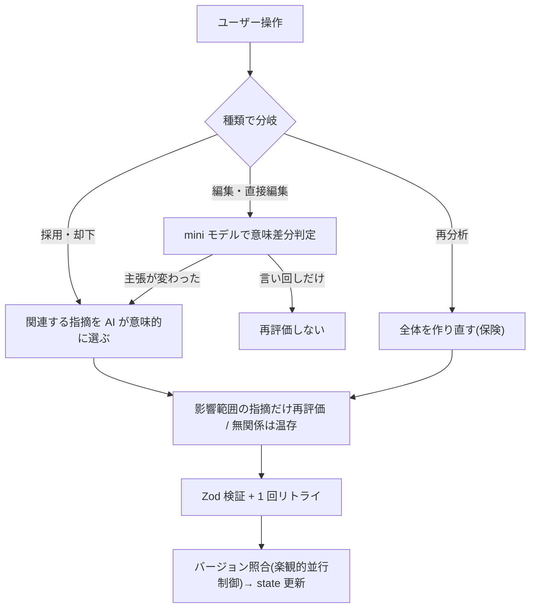

# es-canvas — ESを、あなたの言葉のまま磨く

> AIは選択肢を提示する。最終判断は人間がする。

🌐 [English](README.en.md)

就活生が ES(エントリーシート)を推敲するための Web ツール。AI は文章を丸ごと書き換えず、**文単位で「ここをこう直せる」と提案するだけ**。採用・編集・却下の最終判断は、すべて書き手が握る。Human-in-the-Loop(人間が判断の輪に残る)を中心に据えた設計です。**核は、提案を 1 件採用した後に、残りの指摘を"古い本文へのコメント"として放置せず、意味的に影響する指摘だけを再評価する**点(動的 HITL)にあります。

- **試す(公開デモ)**: <https://es-canvas.vercel.app/>(各自の OpenAI キーを入力 = BYOK)
- **デモ動画(無音・各 5 本)**: [es1](https://youtu.be/wxCK3a4TrHA) ・ [es2](https://youtu.be/tAvlU7Zm1_Y) ・ [es3](https://youtu.be/QbB2qVrTcC8) ・ [es4](https://youtu.be/KWfKMMPNSfg) ・ [es5](https://youtu.be/a1cHOqUgmXU)
- **動画の解説**: [docs/submission_walkthrough.md](docs/submission_walkthrough.md) — 5 本の ES で全機能を実演

---

## 何が違うか

AI に ES を丸投げすると、全文を書き換えられて「あなたらしさ」が消える。es-canvas は、その逆を行く。

その上で、4 つの強みを持ちます。

- **あなたらしさが消えない** — AI は文章を書き換えない。「ここをこう直せる」と選択肢を出すだけで、選ぶのはあなた。だから個性も、何が変わったかも、残ったまま。
- **書いていない強みまで引き出す** — 「その経験、何を工夫した?」と AI が逆質問。書いた範囲を超えて、あなたの中の材料を掘り出す。
- **採用するたびに、添削が進化する** — あなたが一つ決めるたび、残りの指摘も「今の文章」に合わせて作り直される。一度きりで終わらない、生きた添削。
- **企業ごとに、根拠を持って** — 志望企業を実際に調べ、その会社が求める人物像に沿って指摘する。引用元を示し、捏造は構造的に抑える(後述の三層防御。完全には消えない前提)。

さらに、指摘を 3 段階の強さで出し分けます ── **要修正 / 推奨 / 代替案**。「絶対に直すべき」と「好みの選択肢」を区別し、AI が一律に押しつけません。

---

## 使い方

1. **入力** — ES 本文(貼り付け or PDF / Markdown)+ 設問 + 志望企業(URL か社名)+ 添削条件(プリセット or 自由入力)
2. **AI が企業を調べる** — 採用ページ等を調査し、価値観・採用基準を**根拠つき**で整理
3. **AI が ES を分析** — 最大 15 件の指摘 + 3〜5 件の想定面接質問
4. **あなたが 1 件ずつ決める** — 採用 / 編集して採用 / 却下 / 直接編集
5. **AI が必要な所だけ再評価** — 全件やり直しではなく、操作の影響範囲だけ
6. **完成 → コピー**

> API キーは BYOK(Bring Your Own Key)。各自が自分の OpenAI キーを入力して使います(後述)。

---

## 動かすと何が起きるか — 実例 1 本(es1 × メルカリ)

抽象論だけでは伝わらないので、実際の出力で 1 本通します(デモ録画 es1 の実データそのまま)。

**入力**: ガクチカ(英語ディベートサークルで初代女性キャプテン、過去20試合を分析して練習を再設計、出席率 40%→80%、3 名が全国入賞)/ 設問「学生時代に最も力を入れたこと」/ 志望「メルカリ」。

1. **企業を調べる** — AI がメルカリ採用ページを読み、価値観「Go Bold(大胆に挑戦)」「周囲の巻き込み」を **引用元 URL つき**で把握(`careers.mercari.com/jp/hiring/`)。
2. **企業に紐づく指摘** — 締めの「データに基づく仮説検証が…効果を学びました」を「**根拠を持って前例のないやり方を形にし、周囲を巻き込むことで組織を動かせると学びました**」へ。この提案理由は思いつきではなく、上で調べた **Go Bold / 巻き込み**(出典つき)に接続している。
3. **採用する** — 冒頭を「…練習設計の見直しで **3 名を全国大会入賞に導いた経験です**」と成果を前出しする指摘を採用。
4. **関連指摘が"今の本文"に合わせて作り直される(動的 HITL)** — 採用した直後、別の指摘(課題文)の**理由が自動で書き換わる**:
   - 採用前:「『上位に入れない』だと曖昧。後半の『全国大会で入賞』と基準をそろえると締まる」
   - 採用後:「**冒頭で『3 名を全国大会入賞に導いた』と到達点が示されたので**、課題側も同じ指標でそろえると変化幅が一目で伝わる」

   ユーザーの操作を受けて、AI が他の指摘を**言い直している** ── これが「古い指摘を残さない」動的添削の実体です。

> この 1 本だけで「企業グラウンディング(出典つき)」と「採用 → 関連指摘の再評価」が具体的に見えます。5 本それぞれの実演は [docs/submission_walkthrough.md](docs/submission_walkthrough.md)。

---

## 設計の判断(5 つ)

それぞれ「**何を解決するか / どう判断したか / なぜ**」で説明します。さらに踏み込んだ検討(不採用にした案など)は [docs/design_notes.md](docs/design_notes.md) に置いています。

### 1. ユーザーの操作に反応する動的 HITL

**問題**: 既存 AI は「入力 → 一度添削 → 終わり」のワンショット型。ユーザーが指摘を採用しても、添削は**古い ES に対するまま**残る。「この指摘は直した後の今でも当てはまる?」を自分で判断する負担が生まれる。

**判断**: 4 種の操作ごとに、AI が**再評価するか・どの範囲か**を変える。

| 操作 | AI の動き |
|---|---|
| 採用 | 関連する指摘があるときだけ、その範囲を再評価(なければ何もしない) |
| 却下 | 関連する周辺だけ再考 |
| 編集 / 直接編集 | 軽量モデルが「言い回しだけ」か「主張が変わった」かを判定し、後者だけ再評価 |
| 「再分析する」 | 全体を作り直す(保険) |

処理フロー:



**なぜ**: 全件再分析は遅くコストもかかる。「操作の意味」に応じて最小範囲だけ動かす。「関連するか」の判定は機械的な数値ルールではなく **AI 自身に意味で判断させる**(見落としや巻き込みが少なく、HITL の本質=意味的な対話に合う)。

**待たない設計(楽観的並行制御)**: 採用後の再評価は背景で走り、その間もユーザーは**影響を受けない指摘を操作し続けられる**(ロックしない)。続けて別の指摘を採用してもよい。もし操作が走行中の再評価とずれて競合した場合は、結果を黙って捨てたり画面を固めたりせず、「**新しい結果に切り替える / 今の状態を保つ**」を直接選べる通知を出す(中間プレビューなし)。`es_state_version` で各操作がどの版に基づくかを追跡している。

### 2. モデル選択 — 3 系統を実測比較

**問題**: LLM 選びは「とりあえず最新」「ベンダーロックイン」になりがち。だが ES 添削での「コスト・速さ・安定性・質」のバランスは、公式値だけでは分からない。

**判断**: **完成度の高い ES** と **個性の強い ES** の 2 本で、**Anthropic Sonnet / Opus / OpenAI GPT-5.4** を実測比較した(ベンチ用の 2 本で、後述のデモ 5 本とは別)。

| 軸 | Sonnet | Opus | GPT-5.4 |
|---|---|---|---|
| コスト(2 本計) | $0.28 ※ | $1.44 | **$0.375** |
| 平均レイテンシ | 132s | 285s | **111s** |
| 安定性 | 個性強で失敗 | 両方通過 | **リトライ 0・両方通過** |

※ 個性の強い ES での失敗込み。比較は **症状診断の的確さ / 個性保護 / 削減提案 / 引用検証** の 4 観点で評価(詳細は [docs/design_notes.md](docs/design_notes.md))。→ **v1 ではこの実測を根拠に GPT-5.4 へ暫定統一**(2 本での代表評価のため断定はせず、再現用ベンチ `pnpm test:analyze-bench` を残す)。用途別に full(分析・企業調査・面接質問)と mini(編集の意味差分判定。1 秒未満・1 件 $0.001 未満)を使い分ける。

**なぜ**: Opus の方が鋭い瞬間はあるが、コスト約 4 倍・速さ約 1/2.5・個性の強い ES で失敗なしは GPT-5.4 のみ。毎セッション安定して使える方が、HITL ツールの UX として優れる。

### 3. プロンプト設計 — 「良い ES とは何か」を AI に教える

**問題**: 多くの添削 AI が文法・字数止まりなのは、AI に "ES のドメイン知識" を渡していないから。「何が良い ES か」「採用担当は何を見るか」「弱い ES のパターン」が、AI 出力の上限を決める。

**判断**: [`lib/prompts/system.ts`](lib/prompts/system.ts) で明示的に教える。

- **弱い ES のパターン**(空疎な抽象・経験の薄さ・因果の倒置・企業接合の浅さ など)
- **3 層の観点**: ① マナー / 字数 → ② 経験の解像度 → ③ 企業の組織文化との接合
- **採用視点の 2 軸**: 業務との相性 × 人物との相性
- **規律**: 「件数を埋めるな」「深さに応じた長さで書け」「同じ箇所に複数の指摘を出すな」

**指摘は最大 15 件**(判断疲労を避ける上限。完成度の高い ES では 3〜5 件に自制する)。**数値スコアは出さない** — 点数化すると「点を上げること」が目的化し、自己表現という本来の目的を歪めるため(内部の優先度は持つが、UI には high / medium / low のタグでしか反映しない)。

### 4. 捏造を防ぐ三層防御

**問題**: LLM は「読んでいない URL を引用源と称する」「存在しない原文を指摘する」捏造をする。ユーザーが信じて行動すると、面接で破綻する。

**判断**: 3 層で構造的に弾く。

| 層 | 役割 |
|---|---|
| ① モデル品質 | 実測で選定した GPT-5.4 で捏造率を下げる(完全には消えない) |
| ② 承認リスト注入 | 「調査で実際に読んだ URL / 根拠のリストからのみ選べ」と、毎ターン構造で制約する |
| ③ Zod 検証 + 1 回リトライ | 出力を機械検証し、違反は AI に差し戻して 1 回だけ修正させる |

**なぜ**: 「捏造するな」と指示するだけでは確率的に破られる。**選べる選択肢を構造で縛る**(層 ②)のが核。それでも稀に擦り抜けるケースを層 ③ が後段で捕まえる。実装: [`lib/llm/`](lib/llm/) の各 helper。

**層 ③ が実際に弾くもの**([`lib/llm/analyze_helpers.ts`](lib/llm/analyze_helpers.ts)):

- `original_overlap_detected` — 指摘の `original`(原文)が**現在の ES 本文に実在しなければ**、存在しない箇所への指摘=捏造として拒否。
- `evidence_id_not_approved` — 企業価値に基づく指摘の `evidence_id` が、調査で**実際に得た承認リスト**に無ければ拒否。
- **URL 不整合** — `rationale_source.url` が**承認済み URL**(host / path)と一致しなければ拒否。

いずれも検出時はエラー内容を AI に返して **1 回だけ修正再提出**。通らなければユーザーに通知(隠さない)。Zod は併せて構造も強制(指摘 ≤ 15、数値スコア混入の排除 等)。

### 5. 書き込み型 UI — 提出物の綺麗さと、修正の見やすさを両立

**問題**: ES は本人が提出する書類。途中で取り消し線や朱字だらけだと「未完成ドラフト感」が残る。一方で「なぜそう直すか」が見えないと納得できないし、学びにもならない。

**判断**: 役割を分けて両取りする。

- **中央(本文)**: ES 全体を綺麗なまま表示。指摘は**薄い背景色 + 下線だけ**(取り消し線・朱字は出さない)。最終提出物の見え方を保つ
- **右パネル**: 選んだ 1 件を「元 / 提案」の 2 ボックスで対比。**1 件ずつ集中して判断**できる(判断疲労を抑える)
- **すべて Undo 可能**: 直前の取り消し(Cmd+Z)に加え、履歴タブから**任意の過去判断**を戻せる

検討して**不採用にした案**(中央も Word 校閲風にする など)とその理由は [docs/design_notes.md](docs/design_notes.md) に記録しています。

> 段落レベルの構造変更(削除・並べ替え・統合・文移動・追加)を扱う `structural` カテゴリも**実装済み**ですが、**実験的**です(デモ動画では未使用)。削除・並べ替え・統合・文移動は小さな採用単位として機械適用します。ただし `add_paragraph` は現状、短い追加方針(outline)を挿入する暫定実装で、本文への自然な挿入・編集フローは v2 で磨き込みます。「全面書き換えはしない」原則は維持。詳細は design_notes。

---

## 技術と起動

- **Next.js 16**(App Router)/ TypeScript strict / Tailwind v4 + shadcn/ui / Zustand
- **Zod** — LLM 出力のランタイム検証 + 捏造検出
- **LLM**: OpenAI GPT-5.4(full / mini)。**BYOK** — 各ユーザーが自分の OpenAI キーを入力し、**ブラウザにのみ保存**(サーバーには保存しない)

```bash
pnpm install

# ローカル開発時のみ: 自分のキーを置けば入力を省ける
cp .env.example .env.local && $EDITOR .env.local   # OPENAI_API_KEY=...

pnpm dev     # http://localhost:3000(紹介ページ)/ /app(アプリ本体)
pnpm build   # 型チェック + 本番ビルド
```

公開デプロイでは環境変数にキーを置かず、各自が**画面右上の設定**から自分のキーを入力します(BYOK)。

**鍵のデータ境界**(誤解を避けるため明示):キーは**ブラウザの localStorage にのみ保存**され、分析のたびに HTTP ヘッダ `x-openai-key` で**このアプリの API ルートへ一時的に渡る**(OpenAI を呼ぶための経由であって、サーバーには**保存しない・ログにも出さない**)。企業調査のキャッシュは**企業名/URL をキー**にしており、API キーはキャッシュのキーにも値にも含まれない。認証・DB は無く、鍵が存在するのは「あなたのブラウザ」と「リクエスト処理中の一瞬」だけ。

---

## テストデータ(5 本)

「エッジケースを集める」だけでなく、**各 ES が特定の設計判断の試金石**になるよう、5 本を「AI が自制すべき ⇔ 直すべき」「企業情報あり ⇔ なし」の 2 軸で配置しました。

| # | 性格 | 試金石にしているもの |
|---|---|---|
| 1 | 完成度が高い | **AI の自制** — 過剰な指摘や決め台詞の語彙置換を出さないか |
| 2 | 異常に短い・誤字あり | **網羅指摘 + 優先度 + 捏造防止** — エピソード追加を語彙改善より優先できるか、企業情報なしで捏造しないか |
| 3 | 強い個人トーン | **個性保護** — 短文の畳みかけや断定調を壊さず、決め台詞を平板化しないか |
| 4 | 異常に長い(字数超過) | **削減提案** — AI が苦手な「削る」を構造的に出せるか |
| 5 | 矛盾を含む | **矛盾検出** — 数字や時系列の食い違いを見つけられるか |

**実際の結果(各 1 回の代表実行)** — 試金石を「置いた」だけでなく、どう動いたか:

| # | 狙い | 実行結果 |
|---|---|---|
| 1 | 自制 + 企業接続 | 誤字 0・指摘 **5 件に自制**、決め台詞は非改変、締めを Go Bold へ**出典つき**で接続 ✓ |
| 2 | 誤字修正 + 逆質問 + 捏造防止 | 誤字 2 件(「取得しまた」「成積」)を**自動修正**、TOEIC に**逆質問**→回答(600 点台から約 1 年で 900)を反映、企業欄なしで企業価値を**捏造せず** ✓ |
| 3 | 個性保護 | 語り口を「短文を重ねる文学寄り」と**認識**、STAR に整理せず、決め台詞「組織は人で動くが…」**非改変** ✓ |
| 4 | 削減提案 | 総評で「400 字超過、削る優先順位」、全指摘が**圧縮提案**、採用で字数が縮む ✓ |
| 5 | 矛盾検出 | 時系列矛盾「3 年間」を **error で検出**→「2 年間」へ、指摘の原文が ES に**実在**(捏造なし) ✓ |

> LLM 出力は実行ごとに揺れます(指摘の粒度や代替案の有無が変わる)。上表は提出デモ録画と同一の代表 1 回で、再現は各自のキーで可能です。

各 ES の本文と検証チェックリストは [docs/test_es_v1.md](docs/test_es_v1.md)、5 本の操作実演は [docs/submission_walkthrough.md](docs/submission_walkthrough.md)。

---

## v1 でできること / v2 の予定

10 日制約で作った v1 プロトタイプ。できることと、意図的に v2 へ回したことを、隠さず明示します。

### v1 でできること
- **部分指摘**(要修正 / 推奨 / 代替案)+ **段落単位の構造変更**(`structural`、実装済みだが実験的)
- **動的添削** — 採用・却下・編集に応じて関連する指摘を再評価
- **逆質問** — AI が足りない情報を引き出す
- **企業グラウンディング** — 志望企業を調べ、根拠つきで指摘
- **個性保護** / **矛盾検出** / **字数削減**(上限超過時の圧縮)
- **想定面接質問** — ES から、面接で聞かれそうな質問を 3〜5 問生成(答え方のヒントつき)。本文を編集すると「古い」と表示し、再生成できる
- **4 操作**(採用 / 編集して採用 / 却下 / 直接編集)+ すべて **Undo** + 履歴から**任意の過去判断を取り消し**
- **ファイルアップロード**(PDF / Markdown のテキストを本文へ)
- **BYOK**(各自の OpenAI キー)/ **日英 UI**

### v2 の予定
- **ファイルの賢いインポート** — 現状アップロードは**本文だけ**。v2 では AI が**設問・文字数制限も自動抽出**して各欄に入れる(誤抽出に備え「要確認」を明示する設計)
- **マルチパス化** — 1 つの prompt の「読解 + 診断 + 提案」を 3 パスに分けて専門化
- **A/B 盲検評価** — 本実装と「型だけ整える薄い prompt」で同じ ES を添削し、第三者の盲検評価で優劣を実証
- 認証 / 複数 ES 管理 / 共同編集 / モバイル最適化 / 永続保存 は v1 スコープ外

### 既知の制約と v2 での対応

10 日制約の v1 で残った制約を、隠さず開示します。各制約に v2 での対応方針を併記します。

| 既知の制約 | v2 での対応 |
|---|---|
| **待機時間が長い** — 初回は企業調査(約 40 秒)+ 分析を経るため、結果まで待たせる | 提案を 1 件ずつストリーミング表示 / 調査と分析の並列化 / 初回は軽量モデル |
| **企業調査が最新に追従しない** — 速度・コストのため、同じ企業の調査結果を最大 24 時間サーバーにキャッシュする(その間の企業側の更新は反映されない) | キャッシュ期間の短縮 /「最新を取得」での手動再調査 |
| **企業調査が検索に弱い** — web 検索が振るわないときは既知 URL の直接取得に頼るため、URL が当てにくい企業では情報が薄くなる | 検索経路の多重化・フォールバック強化 |
| **面接質問が自動更新されない** — 本文を編集すると「内容が古い」と表示はするが、最新化は手動操作が必要 | 編集に追従して自動で最新化 |
| **代替案が開きにくい** — 好みの言い換え案は判断疲労を避けデフォルト非表示。表示トグルが「全件一覧」内にあり気づきにくい | デフォルト画面から代替案を開く導線を追加 |
| **ハイライトが稀にずれる** — 多数の指摘を連続採用すると、稀にハイライト位置がずれる(**本文は常に正しい**) | 再アンカリングの精緻化 |
| **構造変更の一部** — 文の移動先は段落の先頭/末尾までで、文単位の細かい位置指定は未対応 | 移動位置の粒度を上げる |

---

## 作り方 — AI との協働

このツール自体が「AI は選択肢を提示する。最終判断は人間がする」を実装していますが、**開発プロセスも同じ原則で運営しました**。

- **役割分担**: 人間は判断と方向付けに専念。AI は 3 役に分離 — 対話・設計・指示書作成を担う司令塔/コードだけを書く実装担当/コミットごとに独立検査する評価担当(実装した本人とは別の AI)
- **人間が握ったもの**: 戦略の承認、トレードオフの選択、公開(push)の最終判断。AI の提案は選択肢と引き換え条件を出させてから決める
- **規律**: 非自明な判断はすべて理由・不採用案つきで意思決定ログに記録(1 万行超、非公開)。コミット前に型チェック + lint + 300 件超のオフラインテスト、コミット後に独立 AI レビュー、公開前に機密チェック
- **学習の蓄積**: セッションをまたいで「検証済みの事実」と「未検証の仮説」を構造的に分離した知見ベースを運用し、同じ失敗の再導出を防ぐ

実装コードの大半は AI が書いていますが、何を作り・何を作らないか・どのトレードオフを取るかは人間の判断です。

---

## ドキュメント

- [`docs/design_notes.md`](docs/design_notes.md) — UI の不採用案 / テストデータ設計の詳細 / 構造変更カテゴリ
- [`docs/test_es_v1.md`](docs/test_es_v1.md) — テスト ES 5 本と検証意図
- [`docs/submission_walkthrough.md`](docs/submission_walkthrough.md) — 5 本の操作実演(デモ動画の解説)

プロンプト・ツール定義・スキーマは**コードが正**(SSOT): `lib/prompts/*` / `lib/tools/*` / `lib/schema/*`。

### ディレクトリ早見

```
app/[locale]/page.tsx          # 紹介ページ(LP)
app/[locale]/app/page.tsx      # アプリ本体
app/api/{research,analyze,interview,semantic-diff,extract-text}/route.ts
lib/{llm,prompts,tools,schema,state,concurrency,byok}/
components/{canvas,input,result,layout,landing,ui}/
tests/                          # スモーク / ベンチ / ユニットテスト
```
